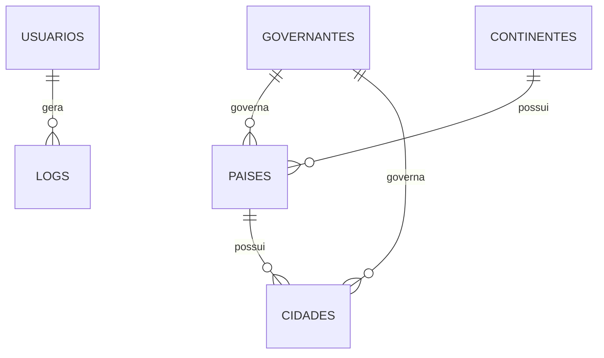

# CRUD Mundo

## Sobre o projeto

Sistema web para gerenciamento de dados geográficos: continentes, países, cidades e governantes. O acesso é protegido por login, com controle de tentativas de senha, bloqueio de contas, troca obrigatória de senha no primeiro acesso e registro de todas as ações de autenticação em logs.

## Funcionalidades

- Cadastro, listagem, edição e exclusão de continentes, países, cidades e governantes
- Painel inicial com total de países, total de cidades e cidade mais populosa
- Pesquisa dinâmica nas tabelas e confirmação antes de excluir registros
- Cadastro de usuários e login com senha criptografada (`password_hash`)
- Bloqueio da conta após 3 tentativas consecutivas de senha incorreta
- Desbloqueio manual de usuários pela tela de usuários
- Troca obrigatória de senha no primeiro acesso e troca de senha pelo menu "Minha Senha"
- Registro de logs (login, falhas, bloqueios, troca de senha, desbloqueio e logout) com tela de consulta

## Tecnologias utilizadas

- PHP
- PDO
- MySQL
- HTML
- CSS
- JavaScript
- Git
- GitHub

## Estrutura do projeto

```
crud-mundo/
├── config/
│   ├── auth.php        # Protege as páginas que exigem login
│   ├── conexao.php     # Conexão com o banco (PDO)
│   ├── env.php         # Leitura do arquivo .env
│   └── log.php         # Função que grava os logs de auditoria
├── css/style.css
├── database/
│   └── bd_mundo.sql    # Criação do banco e das tabelas
├── js/main.js          # Pesquisa nas tabelas e confirmação de exclusão
├── views/
│   ├── cidades/
│   ├── continentes/
│   ├── governantes/
│   ├── paises/
│   ├── usuarios/
│   ├── login/
│   └── logs/
├── .env.example        # Modelo das variáveis de ambiente
└── index.php           # Painel inicial
```

### Modelo de dados



## Como executar

### Requisitos

- PHP 8 com a extensão `pdo_mysql`
- MySQL ou MariaDB (por exemplo, via XAMPP)
- Git

### Passos

1. Clone o repositório e acesse a pasta do projeto:

   ```bash
   git clone https://github.com/<seu-usuario>/projetos-programacao-web.git
   cd projetos-programacao-web/crud-mundo
   ```

2. Crie o banco de dados e as tabelas:

   ```bash
   mysql -u root -p < database/bd_mundo.sql
   ```

   Também é possível importar o arquivo `database/bd_mundo.sql` pelo phpMyAdmin.

3. Configure as variáveis de ambiente copiando o modelo e preenchendo as credenciais do seu MySQL:

   ```bash
   cp .env.example .env
   ```

   O arquivo `.env` não é enviado ao GitHub.

4. Inicie o servidor embutido do PHP:

   ```bash
   php -S localhost:8000
   ```

5. Acesse `http://localhost:8000/views/login/registrar.php`, crie um usuário e faça login. No primeiro acesso, o sistema pede a troca da senha.

Se preferir usar o Apache do XAMPP, copie a pasta `crud-mundo` para `htdocs` e acesse `http://localhost/crud-mundo/`.

## Autor

Eduardo Rodrigo Souza Alves
